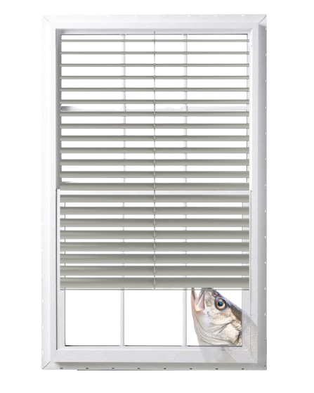

<div align="center">
  
</div>

# fish-autodistrobox

A fish plugin for hooking into `distrobox-assemble`.

### Installation

Install with [fisher](https://github.com/jorgebucaran/fisher):

```shell
fisher install givensuman/fish-autodistrobox
```

### Usage

Whenever you `cd` into a directory containing a `distrobox.ini` file, this plugin will automatically build and enter into it. It also exposes a `distrobox-init` function that creates one for you.

### Environment variables

| Variable                        | Description                                                         | Default   |
| ------------------------------- | ------------------------------------------------------------------- | --------- |
| distrobox_disable_auto_assemble | whether to disable automatically building; any value works          | undefined |
| distrobox_disable_auto_enter    | whether to disable automatically entering; any value works          | undefined |
| distrobox_init_template         | config options of `distrobox.ini` produced by `distrobox-init` call | see below |

#### Notes

A `distrobox.ini` can describe an arbitrary number of container environments, but we only `distrobox-enter` the first one specified by section header.

By default the `distrobox-init` function writes this template file:

```ini
[<dynamically generated section header>]
image=ghcr.io/ublue-os/ubuntu-toolbox:latest
init=false
nvidia=false
pull=true
root=false
replace=true
entry=false
start_now=true
# ---
# distrobox.int/usage/distrobox-assemble
# ---
# additional_flags=" "
# additional_packages=" "
# home=" "
# hostname=" "
# clone=" "
# include=" "
# init_hooks=" "
# pre_init_hooks=" "
# volume=" "
# exported_apps=" "
# exported_bins=" "
# exported_bins_path=" "
# unshare_groups=false
# unshare_ipc=false
# unshare_netns=false
# unshare_process=false
# unshare_devsys=false
# unshare_all=false
```

Set the `distrobox_init_template` as a multi-line string variable to override. For example:

```fish
set -g distrobox_init_template "\
additional_packages='git vim tmux nodejs'
image=ubuntu:latest
nvidia=true
"
```

Note the lack of a section header! Leave that to be dynamically generated.

### License

[MIT](./LICENSE)
